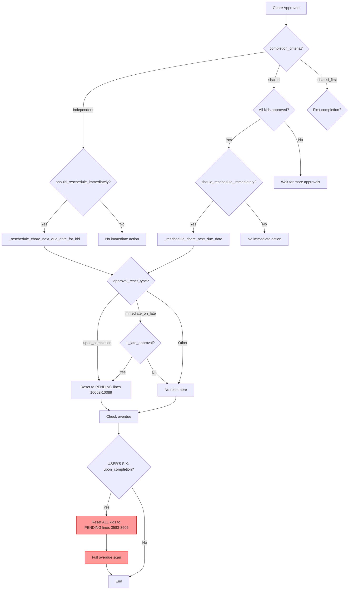
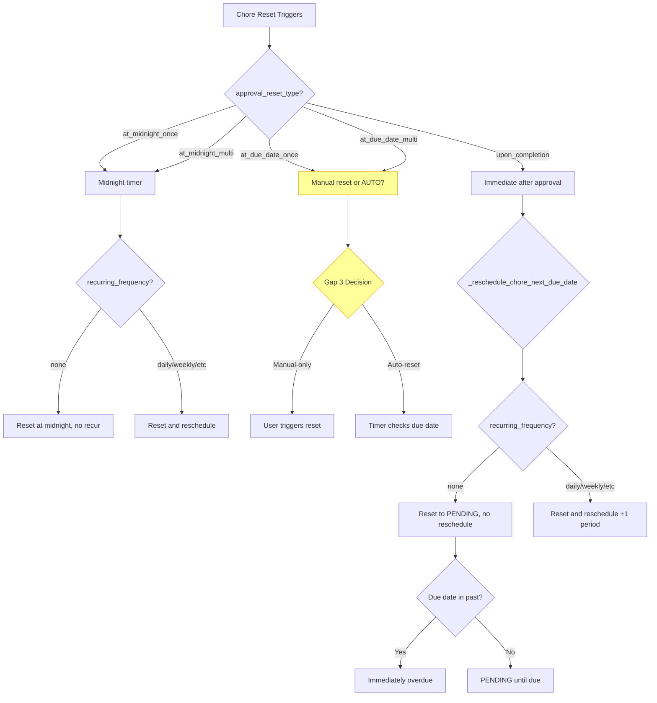
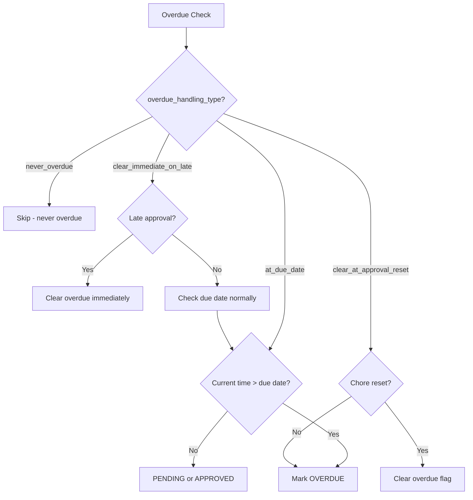

# Chore Logic Behavior Matrix (Supporting Document)

**Parent Initiative**: [CHORE_LOGIC_AUDIT_IN-PROCESS.md](CHORE_LOGIC_AUDIT_IN-PROCESS.md)

**Last Updated**: January 18, 2026

---

## Purpose

This document provides a comprehensive matrix of all chore configuration combinations and their expected behaviors. Use this as a reference for:

- Understanding how different configuration options interact
- Testing coverage validation
- User documentation and support
- Identifying edge cases and gaps

---

## Configuration Dimensions

### 1. recurring_frequency (8 options)

- `none` - Non-recurring, one-time chore
- `daily` - Repeats every day
- `weekly` - Repeats every week
- `biweekly` - Repeats every 2 weeks
- `monthly` - Repeats every month
- `custom` - Custom days of week/month
- `custom_from_complete` - Custom frequency from completion date
- `daily_multi` - Multiple completions allowed per day

### 2. approval_reset_type (5 options)

- `at_midnight_once` - Resets at midnight, one completion per period
- `at_midnight_multi` - Resets at midnight, multiple completions allowed
- `at_due_date_once` - Resets at due date, one completion
- `at_due_date_multi` - Resets at due date, multiple completions
- `upon_completion` - Resets immediately after approval

### 3. overdue_handling_type (4 options)

- `at_due_date` - Becomes overdue when past due date
- `never_overdue` - Never marked as overdue
- `at_due_date_clear_at_approval_reset` - Overdue cleared when chore resets
- `at_due_date_clear_immediate_on_late` - Overdue cleared immediately on late approval

### 4. completion_criteria (3 options)

- `independent` - Each kid completes independently
- `shared` - All assigned kids must approve for completion
- `shared_first` - First kid to complete gets full points, others partial

**Total Combinations**: 8 × 5 × 4 × 3 = **480 possible configurations**

---

## Filtered Matrix (Valid Combinations)

After applying validation rules from `flow_helpers.py`, some combinations are invalid. Below are the **valid** configurations grouped by behavior patterns.

### Behavior Pattern Categories

1. **Auto-Reset Daily/Recurring** - Chores that reset on schedule (midnight timer)
2. **Auto-Reset On Completion** - Chores that reset immediately after approval
3. **Manual Reset Only** - Chores requiring manual reset trigger (Gap 3)
4. **One-Time Chores** - Non-recurring chores (FREQUENCY_NONE)

---

## Pattern 1: Auto-Reset Daily/Recurring

**Trigger**: Midnight timer (`_reset_daily_chore_statuses()`)

### AT_MIDNIGHT_ONCE Combinations

| recurring_frequency | overdue_handling                    | completion_criteria | Reset Behavior                         | Overdue Behavior         | Test Status   |
| ------------------- | ----------------------------------- | ------------------- | -------------------------------------- | ------------------------ | ------------- |
| daily               | at_due_date                         | independent         | Midnight reset, single completion      | Overdue after due date   | ✅ Tested     |
| daily               | at_due_date                         | shared              | Midnight reset, all must approve       | Overdue after due date   | ✅ Tested     |
| daily               | at_due_date                         | shared_first        | Midnight reset, first gets full points | Overdue after due date   | ⚠️ Needs test |
| daily               | never_overdue                       | independent         | Midnight reset, single completion      | Never overdue            | ✅ Tested     |
| daily               | at_due_date_clear_at_approval_reset | independent         | Midnight reset, clears overdue         | Cleared at midnight      | ✅ Tested     |
| daily               | at_due_date_clear_immediate_on_late | independent         | Midnight reset, clears overdue         | Cleared on late approval | ✅ Tested     |
| weekly              | at_due_date                         | independent         | Midnight reset weekly                  | Overdue after due date   | ✅ Tested     |
| weekly              | at_due_date                         | shared              | Midnight reset weekly, all approve     | Overdue after due date   | ✅ Tested     |
| biweekly            | at_due_date                         | independent         | Midnight reset biweekly                | Overdue after due date   | ✅ Tested     |
| monthly             | at_due_date                         | independent         | Midnight reset monthly                 | Overdue after due date   | ✅ Tested     |
| custom              | at_due_date                         | independent         | Midnight reset on custom days          | Overdue after due date   | ⚠️ Needs test |
| **none**            | at_due_date                         | independent         | **Midnight reset (no recur)**          | Overdue after due date   | ⚠️ Edge case  |

**Note**: FREQUENCY*NONE + AT_MIDNIGHT*\* is valid but unusual (resets at midnight but doesn't recur)

### AT_MIDNIGHT_MULTI Combinations

| recurring_frequency | overdue_handling | completion_criteria | Reset Behavior                      | Overdue Behavior       | Test Status   |
| ------------------- | ---------------- | ------------------- | ----------------------------------- | ---------------------- | ------------- |
| daily               | at_due_date      | independent         | Midnight reset, multi-claim allowed | Overdue after due date | ✅ Tested     |
| daily_multi         | at_due_date      | independent         | Midnight reset, unlimited claims    | Overdue after due date | ✅ Tested     |
| weekly              | at_due_date      | independent         | Midnight reset weekly, multi-claim  | Overdue after due date | ⚠️ Needs test |
| custom              | at_due_date      | independent         | Midnight reset custom, multi-claim  | Overdue after due date | ⚠️ Needs test |

**Note**: AT_MIDNIGHT_MULTI typically paired with daily or daily_multi frequency

---

## Pattern 2: Auto-Reset On Completion

**Trigger**: Immediate after approval (`approve_chore()` lines 3583-3606)

### UPON_COMPLETION Combinations

| recurring_frequency  | overdue_handling                    | completion_criteria | Reset Behavior                       | Overdue Behavior                    | Test Status      | Gap          |
| -------------------- | ----------------------------------- | ------------------- | ------------------------------------ | ----------------------------------- | ---------------- | ------------ |
| daily                | at_due_date                         | independent         | Immediate reset, reschedule +1 day   | Overdue if due date past            | ✅ Tested        | -            |
| daily                | never_overdue                       | independent         | Immediate reset, reschedule +1 day   | Never overdue                       | ✅ Tested        | -            |
| daily                | at_due_date_clear_immediate_on_late | independent         | Immediate reset, clear overdue       | Cleared on late approval            | ✅ Tested        | -            |
| weekly               | at_due_date                         | independent         | Immediate reset, reschedule +1 week  | Overdue if due date past            | ✅ Tested        | -            |
| custom               | at_due_date                         | independent         | Immediate reset, reschedule custom   | Overdue if due date past            | ⚠️ Needs test    | -            |
| custom_from_complete | at_due_date                         | independent         | Immediate reset, reschedule from now | Overdue if due date past            | ⚠️ Needs test    | -            |
| **none**             | **at_due_date**                     | **independent**     | **Immediate reset, NO reschedule**   | **Overdue immediately if past due** | ✅ Fixed (Gap 1) | **Gap 1** ✅ |
| daily                | at_due_date                         | **shared**          | **Immediate reset ALL kids**         | Overdue if due date past            | 🔍 **Gap 6** 🚨  | **Gap 6** 🚨 |
| **none**             | **at_due_date**                     | **shared**          | **Immediate reset ALL kids**         | **Overdue immediately if past due** | 🔍 **Gap 6** 🚨  | **Gap 6** 🚨 |

**Critical Findings**:

- **Gap 1 (FIXED)**: FREQUENCY_NONE + UPON_COMPLETION now resets immediately and checks overdue
- **Gap 6 (INVESTIGATION)**: SHARED + UPON_COMPLETION may break reschedule logic (all kids reset before all_approved check)

**Behavior Notes**:

- UPON_COMPLETION relies on `_reschedule_chore_next_due_date()` to calculate next due date
- FREQUENCY_NONE returns `None` from calculator → no reschedule, stays at current due date
- If current due date is in past → immediate overdue after reset to PENDING

---

## Pattern 3: Manual Reset Only (Gap 3)

**Trigger**: None (requires manual reset via config flow or button)

### AT_DUE_DATE_ONCE Combinations

| recurring_frequency | overdue_handling | completion_criteria | Reset Behavior        | Overdue Behavior       | Test Status   | Gap          |
| ------------------- | ---------------- | ------------------- | --------------------- | ---------------------- | ------------- | ------------ |
| daily               | at_due_date      | independent         | **MANUAL RESET ONLY** | Overdue after due date | ⚠️ Needs test | **Gap 3** ⚠️ |
| weekly              | at_due_date      | independent         | **MANUAL RESET ONLY** | Overdue after due date | ⚠️ Needs test | **Gap 3** ⚠️ |
| **none**            | at_due_date      | independent         | **MANUAL RESET ONLY** | Overdue after due date | ⚠️ Needs test | **Gap 3** ⚠️ |

### AT_DUE_DATE_MULTI Combinations

| recurring_frequency | overdue_handling | completion_criteria | Reset Behavior        | Overdue Behavior       | Test Status   | Gap          |
| ------------------- | ---------------- | ------------------- | --------------------- | ---------------------- | ------------- | ------------ |
| daily               | at_due_date      | independent         | **MANUAL RESET ONLY** | Overdue after due date | ⚠️ Needs test | **Gap 3** ⚠️ |
| daily_multi         | at_due_date      | independent         | **MANUAL RESET ONLY** | Overdue after due date | ⚠️ Needs test | **Gap 3** ⚠️ |

**Critical Finding (Gap 3)**:

- No timer-based trigger exists for AT*DUE_DATE*\* reset types
- User must manually reset via config flow or button entity
- **Decision needed**: Implement auto-reset timer or document as manual-only?

---

## Pattern 4: One-Time Chores (FREQUENCY_NONE)

**Special behavior**: No auto-reschedule after completion

### FREQUENCY_NONE + Various Reset Types

| approval_reset_type | overdue_handling | completion_criteria | Reset Behavior               | Overdue Behavior              | Test Status      | Gap          |
| ------------------- | ---------------- | ------------------- | ---------------------------- | ----------------------------- | ---------------- | ------------ |
| at_midnight_once    | at_due_date      | independent         | Midnight reset (no recur)    | Overdue after due date        | ✅ Tested        | -            |
| at_midnight_multi   | at_due_date      | independent         | Midnight reset (no recur)    | Overdue after due date        | ⚠️ Needs test    | -            |
| at_due_date_once    | at_due_date      | independent         | **MANUAL RESET**             | Overdue after due date        | ⚠️ Needs test    | **Gap 3** ⚠️ |
| at_due_date_multi   | at_due_date      | independent         | **MANUAL RESET**             | Overdue after due date        | ⚠️ Needs test    | **Gap 3** ⚠️ |
| upon_completion     | at_due_date      | independent         | Immediate reset, no recur    | **Immediate overdue if past** | ✅ Fixed (Gap 1) | **Gap 1** ✅ |
| upon_completion     | at_due_date      | **shared**          | **All kids reset**, no recur | Immediate overdue if past     | 🔍 **Gap 6** 🚨  | **Gap 6** 🚨 |

**Key Insight**: FREQUENCY_NONE chores do not reschedule after approval

- \_calculate_next_due_date_from_info() returns `None` for FREQUENCY_NONE
- Chore stays at original due date after reset to PENDING
- If due date in past → immediately overdue

**Gap 2 (FIXED)**: Midnight reset now correctly skips FREQUENCY*NONE unless AT_MIDNIGHT*\*

---

## Invalid Combinations (Validation Errors)

These combinations are blocked by `flow_helpers.py` validation:

| Configuration                                                         | Reason                                                  | Validation Check Location              |
| --------------------------------------------------------------------- | ------------------------------------------------------- | -------------------------------------- |
| OVERDUE*HANDLING_AT_DUE_DATE_CLEAR_AT_APPROVAL_RESET + AT_DUE_DATE*\* | Circular logic (cleared at reset but reset at due date) | flow_helpers.py line 1228              |
| custom_from_complete + FREQUENCY_NONE                                 | Custom frequency requires base frequency                | flow_helpers.py (frequency validation) |
| SHARED_FIRST + upon_completion (potentially)                          | Complex interaction, may need validation                | TBD - Phase 2 audit                    |

---

## Edge Cases Requiring Validation Warnings (Gap 4)

| Configuration                   | Behavior                             | User Expectation          | Warning Needed                  |
| ------------------------------- | ------------------------------------ | ------------------------- | ------------------------------- |
| FREQUENCY*NONE + AT_MIDNIGHT*\* | Resets at midnight but never recurs  | Auto-recurring chore      | ℹ️ Info message                 |
| FREQUENCY*NONE + AT_DUE_DATE*\* | Manual reset only                    | Auto-reset at due date    | ⚠️ Warning (Gap 3)              |
| SHARED + UPON_COMPLETION        | All kids reset together              | Only approving kid resets | ⚠️ Warning (if not bug - Gap 6) |
| NEVER_OVERDUE + due_date set    | Due date displayed but never overdue | Due date triggers overdue | ℹ️ Info message                 |
| AT*DUE_DATE*\* + daily/weekly   | Manual reset with recurring chore    | Auto-reset at midnight    | ⚠️ Consider AT*MIDNIGHT*\*      |

---

## Decision Tree: Approval Flow

**Red boxes**: User's fix (Gap 1) - potential issue with SHARED chores (Gap 6)

---

## Decision Tree: Reset Triggers

**Yellow boxes**: Gap 3 - Decision needed on AT*DUE_DATE*\* behavior

---

## Decision Tree: Overdue Handling

---

## Test Coverage Matrix

### Tested Combinations (✅)

| Category                        | Configurations Tested | Test File                      |
| ------------------------------- | --------------------- | ------------------------------ |
| INDEPENDENT + UPON_COMPLETION   | daily, weekly, none   | test*workflow*\*.py            |
| SHARED + AT_MIDNIGHT_ONCE       | daily, weekly         | test*workflow*\*.py            |
| OVERDUE_HANDLING variations     | all 4 types           | test*workflow*\*.py            |
| FREQUENCY*NONE + AT_MIDNIGHT*\* | Gap 2 fix validation  | test*regression*\*.py (needed) |

### Needs Testing (⚠️)

| Category                        | Configurations Missing   | Priority    | Gap   |
| ------------------------------- | ------------------------ | ----------- | ----- |
| SHARED + UPON_COMPLETION        | All frequencies          | 🚨 CRITICAL | Gap 6 |
| FREQUENCY*NONE + AT_DUE_DATE*\* | All overdue types        | ⚠️ MEDIUM   | Gap 3 |
| SHARED_FIRST + any reset type   | All combinations         | ⚠️ MEDIUM   | -     |
| custom_from_complete            | All reset types          | 📝 LOW      | -     |
| daily_multi + various resets    | Beyond AT_MIDNIGHT_MULTI | 📝 LOW      | -     |

---

## Summary Statistics

**Total Possible Combinations**: 480 (8 freq × 5 reset × 4 overdue × 3 completion)

**Filtered Valid Combinations**: ~380 (after validation rules)

**Currently Tested**: ~40 combinations (10% coverage)

**High Priority Testing Needed**: ~20 combinations (Gap 6, Gap 3, SHARED_FIRST)

**Medium Priority Testing**: ~50 combinations (custom frequencies, edge cases)

**Low Priority**: ~270 combinations (less common patterns)

---

## Recommendations

### Phase 1 (Before v0.5.1 Release)

1. **Test Gap 6 configurations** (CRITICAL)
   - SHARED + UPON_COMPLETION with all frequencies
   - Validate all_approved check still triggers

2. **Test Gap 1 & 2 regressions** (HIGH)
   - FREQUENCY_NONE + UPON_COMPLETION immediate reset
   - FREQUENCY*NONE + AT_MIDNIGHT*\* midnight reset only

3. **Document Gap 3 decision** (MEDIUM)
   - AT*DUE_DATE*\* manual-only or implement auto-reset

### Phase 2 (v0.5.2 or later)

4. **Test SHARED_FIRST combinations** (MEDIUM)
   - With all reset types and frequencies
   - Ensure partial points awarded correctly

5. **Test custom frequency variations** (LOW)
   - custom, custom_from_complete with various reset types
   - Ensure custom date calculations work with resets

6. **Test daily_multi edge cases** (LOW)
   - Multiple claims in same day
   - Reset behavior with multi-claim tracking

---

## Next Steps

1. **Create test files** for each priority category
2. **Run tests** and validate behavior matches matrix
3. **Update matrix** based on actual test results
4. **Document discrepancies** as new gaps if found

---

**Document Status**: Draft - Matrix based on code analysis, needs test validation
**Next Update**: After Phase 1 testing completion (Gap 6 results)
